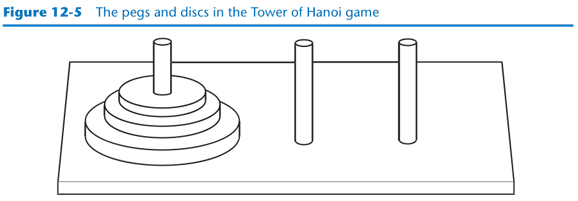
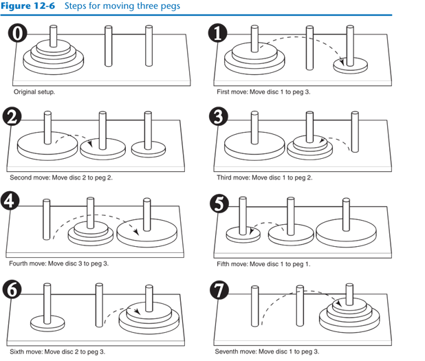

# CS-1120-Project-1

<hr>

### Project 1: The Towers of Hanoi
The Towers of Hanoi is a mathematical game that is often used in computer science to
illustrate the power of recursion. The game uses three pegs and a set of discs with holes
through their centers. The discs are stacked on one of the pegs as shown in Figure 12-5.



Notice the discs are stacked on the leftmost peg, in order of size with the largest disc at the
bottom. The game is based on a legend where a group of monks in a temple in Hanoi have
a similar set of pegs with 64 discs. The job of the monks is to move the discs from the first
peg to the third peg. The middle peg can be used as a temporary holder. Furthermore, the
monks must follow these rules while moving the discs:
+ Only one disk may be moved at a time
+ A disk cannot be placed on top of a smaller disc
+ All discs must be stored on a peg except while being moved

According to the legend, when the monks have moved all of the discs from the first peg to
the last peg, the world will come to an end.[^1]
To play the game, you must move all of the discs from the first peg to the third peg, following
the same rules as the monks. Let’s look at some example solutions to this game,
for different numbers of discs. If you only have one disc, the solution to the game is
simple: move the disc from peg 1 to peg 3. If you have two discs, the solution requires
three moves:
+ Move disc 1 to peg 2
+ Move disc 2 to peg 3
+ Move disc 1 to peg 3

Notice this approach uses peg 2 as a temporary location. The complexity of the moves continues
to increase as the number of discs increases. To move three discs requires the seven
moves shown in Figure 12-6.



The following statement describes the overall solution to the problem:

&ensp;&ensp;_Move n discs from peg 1 to peg 3 using peg 2 as a temporary peg._

The following summary describes a recursive algorithm that simulates the solution to the
game. Notice in this algorithm, we use the variables A, B, and C to hold peg numbers.

_To move n discs from peg A to peg C, using peg B as a temporary peg, do the following:
If n > 0:_<br/>
&ensp;&ensp;_Move n - 1 discs from peg A to peg B, using peg C as a temporary peg._<br/>
&ensp;&ensp;_Move the remaining disc from peg A to peg C._<br/>
&ensp;&ensp;_Move n - 1 discs from peg B to peg C, using peg A as a temporary peg._<br/>

The base case for the algorithm is reached when there are no more discs to move. The
following code is for a function that implements this algorithm. Note the function does
not actually move anything, but displays instructions indicating all of the disc moves to
make.
```python
def move_discs(num, from_peg, to_peg, temp_peg):
    if num > 0:
        move_discs(num - 1, from_peg, temp_peg, to_peg)
        print('Move a disc from peg', from_peg, 'to peg', to_peg)
        move_discs(num - 1, temp_peg, to_peg, from_peg)
```
This function accepts arguments into the following parameters:
```text
num         The number of discs to move.
from_peg    The peg to move the discs from.
to_peg      The peg to move the discs to.
temp_peg    The peg to use as a temporary peg.
```
If num is greater than 0, then there are discs to move. The first recursive call is as follows:
```text
move_discs(num − 1, from_peg, temp_peg, to_peg)
```
This statement is an instruction to move all but one disc from ```from_peg``` to ```temp_peg```, using
```to_peg``` as a temporary peg. The next statement is as follows:
```text
print('Move a disc from peg', from_peg, 'to peg', to_peg)
```
This simply displays a message indicating that a disc should be moved from ```from_peg``` to
```to_peg```. Next, another recursive call is executed as follows:
```text
move-discs(num − 1, temp_peg, to_peg, from_peg)
```
This statement is an instruction to move all but one disc from ```temp_peg``` to ```to_peg```, using
```from_peg``` as a temporary peg. The code in Program 12-7 demonstrates the function by
displaying a solution for the Tower of Hanoi game.

#### Program 12-7 (towers_of_hanoi.py)
```python
# This program simulates the Towers of Hanoi game.

def main():
    # Set up some initial values.
    num_discs = 3
    from_peg = 1
    to_peg = 3
    temp_peg = 2

    # Play the game.
    move_discs(num_discs, from_peg, to_peg, temp_peg)
    print('All the pegs are moved!')
    
# The moveDiscs function displays a disc move in
# the Towers of Hanoi game.
# The parameters are:
#   num:        The number of discs to move.
#   from_peg:   The peg to move from.
#   to_peg:     The peg to move to.
#   temp_peg:   The temporary peg.
def move_discs(num, from_peg, to_peg, temp_peg):
    if num > 0:
        move_discs(num - 1, from_peg, temp_peg, to_peg)
        print(f'Move a disc from peg {from_peg} to peg {to_peg}.')
        move_discs(num - 1, temp_peg, to_peg, from_peg)

# Call the main function.
if __name__ == '__main__':
    main()
```
#### Program Output:
```text
Move a disc from peg 1 to peg 3.
Move a disc from peg 1 to peg 2.
Move a disc from peg 3 to peg 2.
Move a disc from peg 1 to peg 3.
Move a disc from peg 2 to peg 1.
Move a disc from peg 2 to peg 3.
Move a disc from peg 1 to peg 3.
All the pegs are moved!
```

[^1]: In case you’re worried about the monks finishing their job and causing the world to end anytime
soon, you can relax. If the monks move the discs at a rate of 1 per second, it will take them
approximately 585 billion years to move all 64 discs!